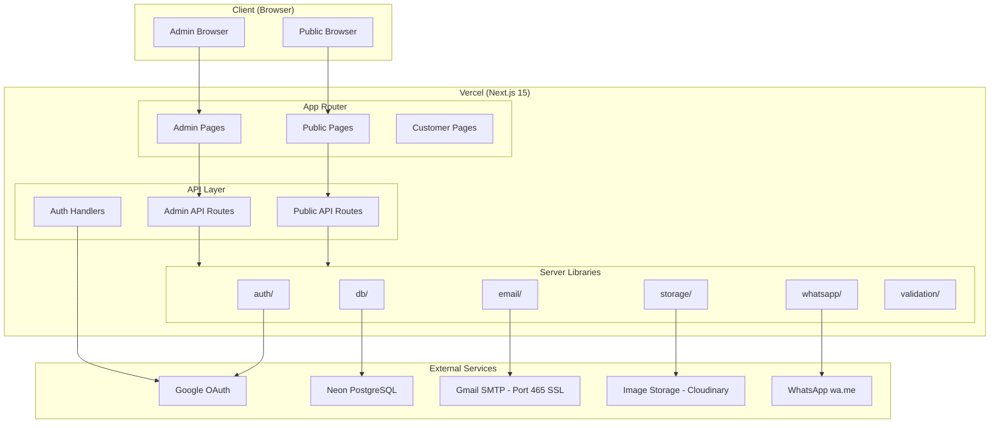

# 10 — System Architecture

## Overview

Soft Showcase is built on a modern Next.js full-stack architecture deployed on Vercel, using Neon PostgreSQL as the database and Prisma as the ORM.

---

## High-Level Architecture Diagram



---

## Technology Stack

| Layer | Technology | Version | Reason |
|---|---|---|---|
| Framework | Next.js | 15 | App Router, server components, server actions |
| Language | TypeScript | 5.x | Type safety throughout |
| Database | PostgreSQL | 16 | Relational, reliable, free on Neon |
| ORM | Prisma | 5.x | Type-safe DB access, migrations |
| Auth | NextAuth.js | v5 (Auth.js) | Google OAuth, session management |
| Validation | Zod | 3.x | Schema validation on server |
| Email | Gmail SMTP (Nodemailer) | Latest | Direct SMTP over port 465 with SSL/TLS |
| Storage | Cloudinary | Latest | Image hosting, transformations, free tier |
| Styling | Tailwind CSS | 3.x | Utility-first, fast development |
| UI Components | shadcn/ui | Latest | Accessible, customizable |
| Hosting | Vercel | — | Zero-config Next.js deployment |

---

## Request Flow (Public)

```
Browser
  ↓
Vercel Edge Network (CDN cache for static pages)
  ↓
Next.js App Router
  ↓
Server Component renders page
  ↓
Prisma → Neon PostgreSQL
  ↓
Response rendered and sent
```

---

## Request Flow (API — Inquiry Submission)

```
Browser submits inquiry form
  ↓
POST /api/inquiries
  ↓
Rate limiter check
  ↓
Zod validation
  ↓
Server resolves: project → provider → email
  ↓
Prisma: INSERT inquiry
  ↓
Email Service → Gmail SMTP (Port 465 SSL) → Provider inbox
  ↓
Email Service → Gmail SMTP (Port 465 SSL) → Customer inbox (confirmation)
  ↓
JSON response: { success: true }
```

---

## Data Access Layers

```
Page/Component (React)
      ↓
Server Action or API Route (Next.js)
      ↓
Validation Layer (Zod)
      ↓
Authorization Check
      ↓
Prisma Client
      ↓
Neon PostgreSQL
```

**Rule:** Database is NEVER accessed from client components. Only server components, server actions, and API routes may use Prisma.

---

## Authentication Architecture

```
User clicks "Sign in with Google"
      ↓
NextAuth.js redirect to Google
      ↓
Google authenticates user
      ↓
Google sends authorization code to callback URL
      ↓
NextAuth.js exchanges code for tokens
      ↓
NextAuth.js checks if user exists in DB
      ↓
Creates/updates user record
      ↓
Creates session (JWT or database session)
      ↓
User is authenticated
      ↓
Admin check: reads users.isAdmin
```

---

## Email Architecture

```
Server receives inquiry
      ↓
Resolves provider email from DB (NEVER from client)
      ↓
Builds email payload using template
      ↓
Sends via Gmail SMTP (smtp.gmail.com:465, SSL/TLS)
      ↓
Gmail delivers to provider inbox
```

Direct SSL/TLS over port 465 with Google App Password. Port 587 is not used.

---

## Image Storage Architecture

```
Admin selects image file
      ↓
Client sends file to /api/admin/uploads
      ↓
Server validates: type (jpg/png/webp), size (<5MB)
      ↓
Server uploads to Cloudinary via Cloudinary API
      ↓
Cloudinary returns secure URL
      ↓
Server saves URL to project_images table
      ↓
Images served via Cloudinary CDN
```

---

## WhatsApp Architecture

```
Customer clicks "Discuss on WhatsApp"
      ↓
GET /api/projects/[slug]/whatsapp
      ↓
Server looks up: project.provider.whatsappNumber
      ↓
Server generates pre-filled message text
      ↓
Server encodes and returns wa.me URL
      ↓
Client opens URL in new tab
      ↓
WhatsApp opens with provider's number
```

---

## Folder Structure (Top Level)

```
soft-showcase/
│
├── app/                    ← Next.js App Router
│   ├── (public)/           ← Public pages group
│   ├── (auth)/             ← Authentication pages
│   ├── (customer)/         ← Authenticated customer pages
│   ├── admin/              ← Admin pages (protected)
│   ├── api/                ← API routes
│   └── layout.tsx          ← Root layout
│
├── components/             ← Shared React components
│   ├── ui/                 ← Base UI (shadcn/ui based)
│   ├── layout/             ← Navbar, Footer, Sidebar
│   ├── projects/           ← Project-specific components
│   ├── providers/          ← Provider-related components
│   ├── inquiry/            ← Inquiry form components
│   └── admin/              ← Admin-specific components
│
├── lib/                    ← Server-side utilities
│   ├── auth/               ← Auth helpers, session utils
│   ├── db/                 ← Prisma client, DB helpers
│   ├── email/              ← Email service, templates
│   ├── storage/            ← Image upload service
│   ├── whatsapp/           ← WhatsApp URL generator
│   ├── validation/         ← Zod schemas
│   └── utils/              ← General utilities
│
├── prisma/                 ← Prisma schema + migrations
│   └── schema.prisma
│
├── types/                  ← Shared TypeScript types
│
├── config/                 ← App configuration constants
│
├── docs/                   ← Platform documentation
│
├── public/                 ← Static assets
│
├── .env.example            ← Environment variable template
├── .gitignore
├── README.md
└── package.json
```

---

## Environment Tiers

| Tier | Database | Description |
|---|---|---|
| Local Development | Local PostgreSQL or Neon dev branch | Developer machines |
| Preview | Neon preview branch | Vercel preview deployments |
| Production | Neon production | Live site |

---

## Scalability Notes

Soft Showcase V1 is designed for low-to-medium traffic.

- Static generation for project detail pages (revalidated on publish)
- Incremental static regeneration for catalog page
- Database connection pooling via Neon's built-in pooler
- Images served via Cloudinary CDN (not from Next.js server)
- Email via external API (no blocking SMTP connections)

Future scaling options (not implemented in V1):

- Redis for rate limiting (currently in-memory)
- Database read replicas
- Search engine (Algolia/Meilisearch) for full-text search
