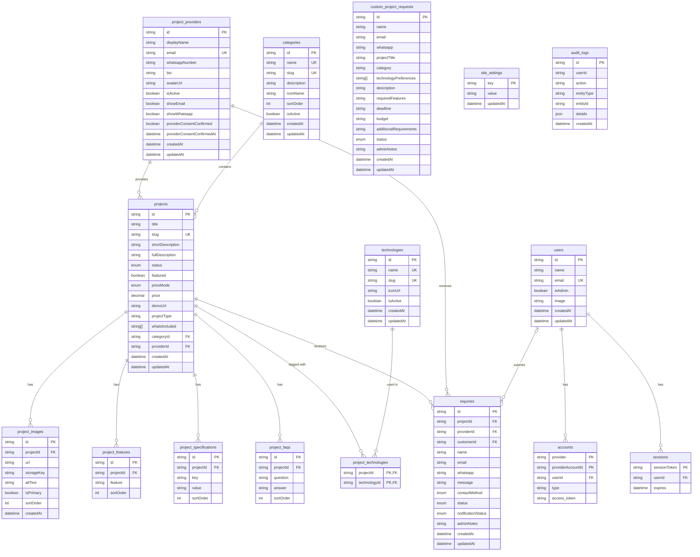

# 14 — Database ERD

## Entity-Relationship Diagram



> **V1 Scope Note:** The `favorites` table is excluded from V1 to keep the initial release lean and focused on project discovery and lead generation.

---

## Relationship Cardinality Summary

| Entity A | Relationship | Entity B | Notes |
|---|---|---|---|
| User | has many | Accounts | OAuth provider accounts |
| User | has many | Sessions | Active login sessions |
| ProjectProvider | has many | Projects | One provider → many projects |
| Project | belongs to one | ProjectProvider | One project → one provider |
| Project | belongs to one | Category | One project → one category |
| Project | has many | Technologies | Via `project_technologies` join table |
| Project | has many | ProjectImages | Ordered by sortOrder; stores storageKey |
| Project | has many | ProjectFeatures | Ordered by sortOrder |
| Project | has many | ProjectSpecifications | Ordered by sortOrder |
| Project | has many | ProjectFaqs | Ordered by sortOrder |
| Project | has many | Inquiries | All email inquiries |
| ProjectProvider | has many | Inquiries | All inquiries directed at provider |
| User | has many | Inquiries | Optional customer link for tracking |

---

## Status Enums

### ProjectStatus
```
DRAFT      ← Default; not visible to public
PUBLISHED  ← Visible on catalog (requires publication gate approval)
ARCHIVED   ← Hidden; soft-deleted and preserved in DB
```

### PriceMode
```
CONTACT       ← No price shown; contact for pricing (price = null)
FIXED         ← Specific fixed price shown (price required)
STARTING_FROM ← "Starting from ₹X,XXX" (price required)
FREE          ← Free project (price = null)
```

### InquiryStatus
```
NEW        ← Just received; not yet acted on
CONTACTED  ← Provider has been in contact
DISCUSSING ← Active discussion
QUOTED     ← Price quote sent
CLOSED     ← Conversation ended (no deal or complete)
```

### NotificationStatus
```
PENDING    ← Inquiry saved in DB, notification email queued/in-flight
SENT       ← Notification email successfully sent to provider
FAILED     ← Email sending failed; visible in admin for retry
```

### CustomRequestStatus
```
NEW         ← New request submitted
REVIEWING   ← Admin reviewing requirements
CONTACTED   ← Admin/provider contacted customer
IN_PROGRESS ← Custom project work in progress
COMPLETED   ← Request completed
DECLINED    ← Request declined
```

### ContactMethod
```
EMAIL      ← Inquiry submitted via email form
WHATSAPP   ← Customer reached out via WhatsApp
```
