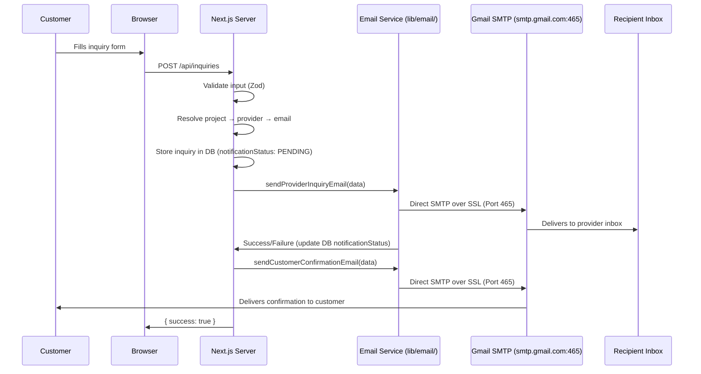

# 18 — Email Architecture

## Core Principle

**Gmail SMTP directly over port 465 with SSL/TLS enabled.**

Soft Showcase uses direct Gmail SMTP via `nodemailer` on port 465 with SSL/TLS encryption.

- **Host**: `smtp.gmail.com`
- **Port**: `465` (SSL/TLS direct connection)
- **Security**: Port 465 with `secure: true`. Port 587 is **not** used.
- **Authentication**: Google App Password (not the user's primary Google account password).
- **Execution**: Strictly server-side inside Next.js Route Handlers and Server Actions. SMTP credentials are never exposed to client-side code.

---

## Email Flow Diagram



---

## Email Service Architecture

```
lib/email/
├── email-service.ts            # Public API: sendEmail, sendProviderInquiryEmail, sendAdminCustomRequestEmail, etc.
├── providers/
│   └── email-provider.ts       # GmailSmtpProvider implementation & createEmailProvider() factory
└── templates/
    ├── provider-inquiry.ts     # HTML template: new inquiry for provider
    ├── customer-confirmation.ts# HTML template: inquiry confirmation for customer
    ├── admin-notification.ts   # HTML template: new custom request for admin
    └── custom-request-customer.ts # HTML template: custom request confirmation for customer
```

### Provider Abstraction

All outgoing emails pass through the `EmailProvider` interface:

```typescript
export interface EmailMessage {
  to: string;
  from?: string;
  fromName?: string;
  subject: string;
  html: string;
  text?: string;
}

export interface EmailResult {
  success: boolean;
  messageId?: string;
  error?: string;
}

export interface EmailProvider {
  send(message: EmailMessage): Promise<EmailResult>;
}
```

### Gmail SMTP Implementation

```typescript
export class GmailSmtpProvider implements EmailProvider {
  private host: string;
  private port: number;
  private secure: boolean;
  private user: string;
  private pass: string;

  constructor() {
    this.host = process.env.SMTP_HOST || "smtp.gmail.com";
    this.port = parseInt(process.env.SMTP_PORT || "465", 10);
    this.secure = process.env.SMTP_SECURE !== "false";
    this.user = process.env.SMTP_USER || process.env.EMAIL_FROM || "";
    this.pass = process.env.SMTP_PASSWORD || "";
  }

  async send(message: EmailMessage): Promise<EmailResult> {
    const transporter = nodemailer.createTransport({
      host: this.host,
      port: this.port,
      secure: this.secure, // true for port 465 SSL/TLS
      auth: {
        user: this.user,
        pass: this.pass,
      },
    });

    const info = await transporter.sendMail({
      from: `"${process.env.EMAIL_FROM_NAME}" <${process.env.EMAIL_FROM}>`,
      to: message.to,
      subject: message.subject,
      html: message.html,
      text: message.text,
    });

    return { success: true, messageId: info.messageId };
  }
}
```

---

## Gmail SMTP Setup Guide

1. **Enable 2-Step Verification** on the Google Account.
2. Navigate to **Google Account Settings > Security > 2-Step Verification > App passwords**.
3. Generate a new App Password named `Soft Showcase`.
4. Copy the generated 16-character password into `SMTP_PASSWORD` in `.env.local`.
5. **Never use your standard Google password** — Google requires App Passwords for SMTP access.
6. **Port 465 is mandatory**: Connects using implicit SSL/TLS. Do NOT use port 587 (STARTTLS).

---

## Environment Variables

```bash
# Email Provider
EMAIL_PROVIDER="gmail"

# Gmail SMTP Settings
SMTP_HOST="smtp.gmail.com"
SMTP_PORT="465"
SMTP_SECURE="true"
SMTP_USER="my-gmail-address"
SMTP_PASSWORD="my-google-app-password"

# Outgoing Email Branding
EMAIL_FROM="my-gmail-address"
EMAIL_FROM_NAME="Soft Showcase"

# Platform Admin Email
ADMIN_EMAIL="admin@yourdomain.com"
```

---

## Security Rules

1. **Provider email is NEVER from client input.** Server always resolves `project → provider → email`.
2. **SMTP credentials are server-side only.** Never passed to client components or exposed with `NEXT_PUBLIC_`.
3. **Never commit `.env.local` to git.** It contains private App Passwords.
4. **Recipients are validated.** Server determines all To: addresses.
5. **No arbitrary email sending.** Only predefined template functions are exposed.
6. **Errors are logged server-side.** Customers see friendly, safe error messages.

---

## Error Handling & Delivery Tracking

Inquiries are first created in the database with `notificationStatus = PENDING`. Email delivery is then attempted:

```typescript
try {
  const result = await sendProviderInquiryEmail(data);
  if (result.success) {
    await prisma.inquiry.update({
      where: { id: inquiry.id },
      data: { notificationStatus: "SENT" },
    });
  } else {
    await prisma.inquiry.update({
      where: { id: inquiry.id },
      data: { notificationStatus: "FAILED" },
    });
  }
} catch (error) {
  console.error("[Email] Failed to send provider inquiry email:", error);
  await prisma.inquiry.update({
    where: { id: inquiry.id },
    data: { notificationStatus: "FAILED" },
  });
}
```

If email delivery fails, the inquiry remains safely stored in the database with `notificationStatus = FAILED`. The admin sees this in `/admin/inquiries` and can follow up directly.

---

## Rate Limiting on Email Endpoints

The `/api/inquiries` and `/api/custom-requests` endpoints are rate limited to prevent abuse:
- Configured via `RATE_LIMIT_PROVIDER`
- Returns HTTP 429 if rate limit is exceeded
