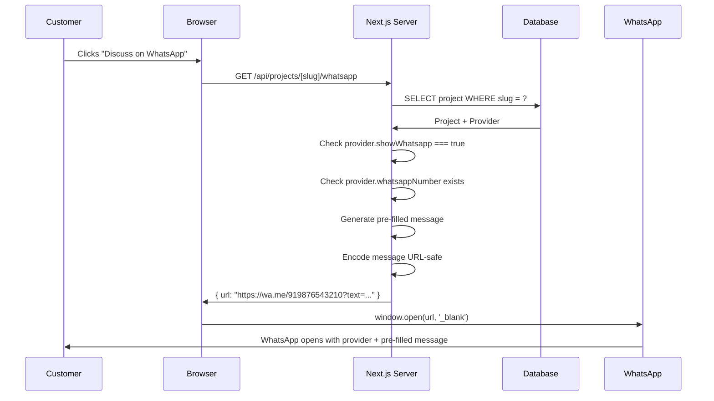

# 20 — WhatsApp Architecture

## Overview

The WhatsApp contact system enables customers to reach project providers directly via WhatsApp. It uses WhatsApp's deep link protocol (`wa.me`) — no API key or WhatsApp Business API is required.

---

## How wa.me Works

WhatsApp provides a universal deep link:

```
https://wa.me/{phone_number}?text={url_encoded_message}
```

When a user opens this URL:
- On mobile: WhatsApp app opens
- On desktop: WhatsApp Web opens
- Pre-filled message appears in the chat input
- The user must tap Send manually

**No account or API integration is needed for this basic flow.**

---

## WhatsApp Flow



---

## WhatsApp Message Template

The message is generated server-side:

```
Hi, I'm interested in the "[Project Title]" project listed on Soft Showcase.

Project: [Project Title]

I would like to know:
- Price
- Features included
- Customization options
- Delivery details

Please let me know when you're available to discuss.

Thank you!
```

---

## Phone Number Format

### Stored in Database

```
+919876543210   (with country code and + prefix)
```

### Used in wa.me URL

```
919876543210    (country code without + prefix)
```

**Conversion:** Strip the leading `+` character.

```typescript
function formatWhatsAppNumber(number: string): string {
  return number.replace(/^\+/, "").replace(/\s/g, "");
}
```

---

## WhatsApp URL Generator

```typescript
// lib/whatsapp/whatsapp.ts

interface WhatsAppOptions {
  phoneNumber: string;   // In +XXXXXXXXXXXX format
  projectTitle: string;
  projectId: string;
}

export function generateWhatsAppUrl(options: WhatsAppOptions): string {
  const { phoneNumber, projectTitle, projectId } = options;

  // Format number (remove + and spaces)
  const formattedNumber = phoneNumber.replace(/^\+/, "").replace(/\s/g, "");

  // Generate message
  const message = `Hi, I'm interested in the "${projectTitle}" project listed on Soft Showcase.

I would like to know:
- Price
- Features included
- Customization options
- Delivery details

Please let me know when you're available to discuss.`;

  // URL encode the message
  const encodedMessage = encodeURIComponent(message);

  return `https://wa.me/${formattedNumber}?text=${encodedMessage}`;
}
```

---

## API Route

```typescript
// app/api/projects/[slug]/whatsapp/route.ts

export async function GET(
  request: Request,
  { params }: { params: { slug: string } }
) {
  // Rate limit check
  const ip = getClientIp(request);
  const limited = await rateLimiter.check(ip, "whatsapp");
  if (limited) return NextResponse.json({ error: "Rate limited" }, { status: 429 });

  // Find project
  const project = await prisma.project.findUnique({
    where: { slug: params.slug, status: "PUBLISHED" },
    include: { provider: true },
  });

  if (!project) {
    return NextResponse.json({ error: "Not found" }, { status: 404 });
  }

  // Check provider settings
  if (!project.provider.showWhatsapp) {
    return NextResponse.json({ error: "WhatsApp not available" }, { status: 403 });
  }

  if (!project.provider.whatsappNumber) {
    return NextResponse.json({ error: "No WhatsApp configured" }, { status: 400 });
  }

  // Generate URL
  const url = generateWhatsAppUrl({
    phoneNumber: project.provider.whatsappNumber,
    projectTitle: project.title,
    projectId: project.id,
  });

  return NextResponse.json({ success: true, data: { url } });
}
```

---

## Client-Side Button

```typescript
// components/inquiry/WhatsAppButton.tsx

"use client";

interface Props {
  projectSlug: string;
}

export function WhatsAppButton({ projectSlug }: Props) {
  const [loading, setLoading] = useState(false);

  async function handleClick() {
    setLoading(true);
    try {
      const res = await fetch(`/api/projects/${projectSlug}/whatsapp`);
      const data = await res.json();

      if (data.success) {
        window.open(data.data.url, "_blank", "noopener,noreferrer");
      }
    } catch {
      // Show error toast
    } finally {
      setLoading(false);
    }
  }

  return (
    <button onClick={handleClick} disabled={loading}>
      💬 {loading ? "Opening..." : "Discuss on WhatsApp"}
    </button>
  );
}
```

---

## Security Notes

1. **Phone number is never in the page HTML.** The client only has the project slug; the number is resolved server-side.
2. **Rate limited** to prevent abuse.
3. **Provider flag checked** — `showWhatsapp` must be true.
4. **Project must be PUBLISHED** — unpublished projects cannot generate WhatsApp links.

---

## V1 Limitations

| Limitation | Notes |
|---|---|
| No tracking | WhatsApp conversations happen outside Soft Showcase |
| No read receipts | No way to know if provider responded |
| No message history | WhatsApp chat is private between provider and customer |

**Future (V2):**

- Log WhatsApp button clicks as `WHATSAPP` contact method inquiries
- Track which projects receive the most WhatsApp clicks
- Add optional WhatsApp webhook integration

---

## Testing WhatsApp Links

To test locally:

1. Generate a link manually:
   ```
   https://wa.me/919876543210?text=Hi%2C%20I%27m%20interested...
   ```
2. Open in browser.
3. Verify WhatsApp Web opens with correct number and pre-filled message.
4. Test on mobile to verify app opens.

**Test with a real phone number you control.**
