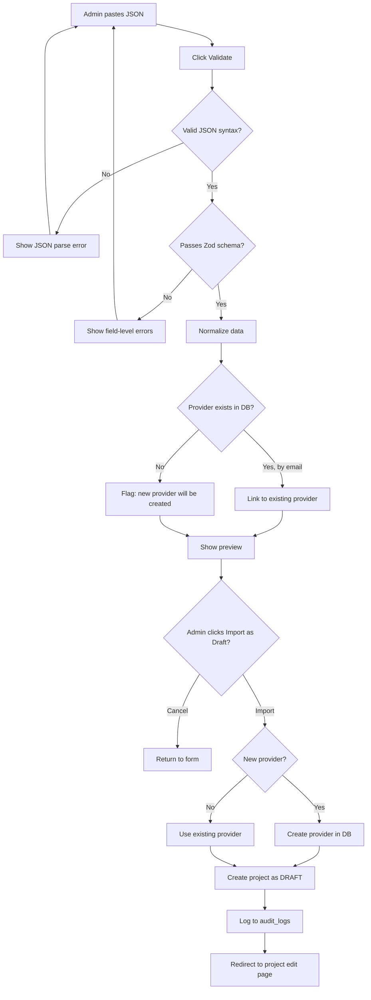

# 22 — Project Import System

## Overview

The project import system allows an administrator to paste AI-generated or manually-written JSON into the platform and import it as a DRAFT project.

This enables a powerful workflow:

```
Admin provides project info to AI assistant
        ↓
AI generates structured JSON (following the template)
        ↓
Admin copies JSON
        ↓
Admin opens /admin/projects/import
        ↓
Admin pastes JSON
        ↓
System validates
        ↓
Admin previews result
        ↓
Admin imports as DRAFT
        ↓
Admin adds screenshots manually
        ↓
Admin publishes when ready
```

---

## Import Flow (Detailed)



---

## Import JSON Format

See [Project Import Template](23-project-import-template.md) for the full template.

Example:

```json
{
  "title": "AI Resume Analyzer",
  "shortDescription": "An AI-powered platform for analyzing resumes.",
  "fullDescription": "A comprehensive web application that uses AI to analyze...",
  "category": "AI / Machine Learning",
  "projectType": "Web Application",
  "technologies": [
    "Python",
    "Flask",
    "PostgreSQL",
    "JavaScript"
  ],
  "features": [
    "Resume upload and parsing",
    "ATS compatibility analysis",
    "Skill extraction and matching",
    "Downloadable analysis report"
  ],
  "specifications": {
    "frontend": "HTML, CSS, JavaScript",
    "backend": "Python Flask",
    "database": "PostgreSQL",
    "authentication": "Google OAuth",
    "deployment": "Vercel"
  },
  "whatsIncluded": [
    "Complete source code",
    "Database schema",
    "API documentation",
    "Installation guide"
  ],
  "faq": [
    {
      "question": "Can this be customized?",
      "answer": "Yes, the project can be customized upon request."
    }
  ],
  "priceMode": "CONTACT",
  "price": null,
  "demoUrl": "https://demo.example.com",
  "provider": {
    "name": "Rahul",
    "email": "rahul@example.com",
    "whatsapp": "+919876543210"
  }
}
```

---

## Zod Validation Schema

```typescript
// lib/validation/project-import.schema.ts

import { z } from "zod";

const ProviderSchema = z.object({
  name: z.string().min(2).max(100),
  email: z.string().email(),
  whatsapp: z.string().regex(/^\+[1-9]\d{7,14}$/).optional().or(z.literal("")),
});

const FaqSchema = z.object({
  question: z.string().min(5).max(500),
  answer: z.string().min(5).max(2000),
});

export const ProjectImportSchema = z
  .object({
    title: z.string().min(3).max(200),
    shortDescription: z.string().min(10).max(500),
    fullDescription: z.string().min(20),
    category: z.string().min(2).max(100),
    projectType: z.string().min(2).max(100).optional(),
    technologies: z.array(z.string().min(1).max(50)).min(1).max(20),
    features: z.array(z.string().min(2).max(200)).min(1).max(50),
    specifications: z.record(z.string(), z.string()),
    whatsIncluded: z.array(z.string().min(2).max(200)).optional().default([]),
    faq: z.array(FaqSchema).optional().default([]),
    priceMode: z.enum(["CONTACT", "FIXED", "STARTING_FROM", "FREE"]),
    price: z.number().positive().nullable().optional(),
    demoUrl: z.string().url().optional().or(z.literal("")),
    provider: ProviderSchema,
  })
  .refine(
    (data) => {
      if (data.priceMode === "FIXED" || data.priceMode === "STARTING_FROM") {
        return typeof data.price === "number" && data.price > 0;
      }
      return data.price === null || data.price === undefined;
    },
    {
      message:
        "price is required and must be positive when priceMode is FIXED or STARTING_FROM; price must be null or omitted for CONTACT or FREE",
      path: ["price"],
    }
  );

export type ProjectImportData = z.infer<typeof ProjectImportSchema>;
```

---

## Data Normalization

After Zod validation, the data is normalized:

1. **Slug generation:** `title → slugify → check uniqueness → append suffix if duplicate`
2. **Category matching:** Find existing category by name (case-insensitive). If not found, create it.
3. **Technology matching:** Find each technology by name. If not found, create it.
4. **Provider matching:** Look up `providers WHERE email = provider.email`. If found, use it. If not, create it with `providerConsentConfirmed = false`.

---

## Provider Matching Logic

```typescript
async function resolveProvider(providerData: ProviderImportData) {
  // Try to find by email
  const existing = await prisma.projectProvider.findUnique({
    where: { email: providerData.email },
  });

  if (existing) {
    // Provider exists — use it
    // Note: Do NOT update existing provider's details from import
    return { provider: existing, created: false };
  }

  // Create new provider
  // Newly imported providers require admin consent confirmation before
  // any project assigned to them can be published.
  const newProvider = await prisma.projectProvider.create({
    data: {
      displayName: providerData.name,
      email: providerData.email,
      whatsappNumber: providerData.whatsapp || null,
      showWhatsapp: true,
      showEmail: false,
      isActive: true,
      providerConsentConfirmed: false,
      providerConsentConfirmedAt: null,
    },
  });

  return { provider: newProvider, created: true };
}
```

**Important:** If the provider already exists in the database (matched by email), the import does NOT update the existing provider's details. It simply links the new project to the existing provider. If a new provider is created, `providerConsentConfirmed` defaults to `false` and must be confirmed in `/admin/providers/[id]/edit` prior to publication.

---

## Import Preview Page

Before saving, the admin sees:

```
Project Import Preview
━━━━━━━━━━━━━━━━━━━━━━━━━━━━━━━━━━━━━━━━━━━━━━

Title:          AI Resume Analyzer
Category:       AI / Machine Learning (existing ✓)
Project Type:   Web Application

Technologies:   Python, Flask, PostgreSQL, JavaScript
                [3 existing ✓] [1 new: will be created]

Features:       4 features

Specifications: 5 keys

Price Mode:     CONTACT
Price:          —

Provider:       Rahul (rahul@example.com)
                [Provider exists in database ✓]

Demo URL:       https://demo.example.com ✓

━━━━━━━━━━━━━━━━━━━━━━━━━━━━━━━━━━━━━━━━━━━━━━

⚠ This project will be imported as DRAFT.
  It will not be visible to the public until published.

[ Import as Draft ]    [ Cancel ]
```

---

## Import Error Messages

| Error | Message Shown |
|---|---|
| Invalid JSON syntax | "The JSON you pasted is not valid. Please check for missing brackets or quotes." |
| Missing required field | "Required field missing: [fieldName]" |
| Invalid email format | "Provider email is not a valid email address." |
| Invalid WhatsApp format | "WhatsApp number must be in international format (+919876543210)." |
| Price mode invalid | "Price mode must be one of: CONTACT, FIXED, STARTING_FROM, FREE." |
| Title too short | "Title must be at least 3 characters." |
| Duplicate slug | "A project with this title already exists. A unique slug will be generated." |

---

## Post-Import Steps

After import, the admin is redirected to the project edit page.

Checklist shown to admin:

```
✅ Project imported successfully as DRAFT.

Next steps:
☐ Upload screenshots
☐ Verify provider contact settings
☐ Review full description
☐ Check features and specifications
☐ Add FAQ if needed
☐ Publish when ready
```

---

## What Cannot Be Imported

- Screenshots (must be uploaded separately)
- Provider avatar
- Admin notes
- Audit history
